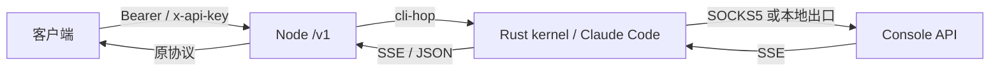
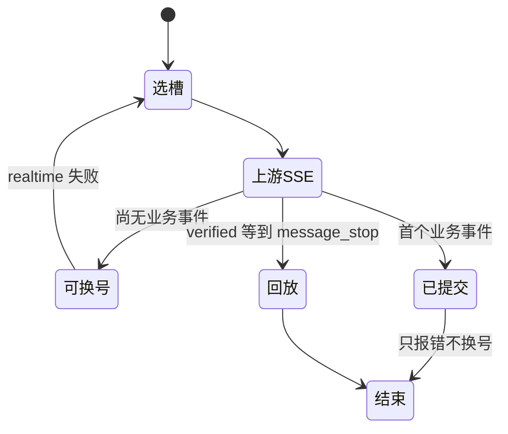

# API 用法

协议口默认本机 `:8787`（生产可用 nginx 反代）。本文只写 **现在代码里的客户端契约**。面板口见 [PANEL_API.md](PANEL_API.md)。出站行为见 [PROTOCOL.md](PROTOCOL.md)。



## 鉴权

| 密钥 | 来源 | 能调 |
|------|------|------|
| Master `VM2API_API_KEY` | 环境变量 | `/v1/*` + `/api/panel/*` + `/admin/*` |
| `sk-vm-…` | 控制台签发 | **只** `/v1/*` |
| 面板会话 | 面板登录 | **只** `/api/panel/*` |

请求头任选其一：

```http
Authorization: Bearer sk-vm-…
x-api-key: sk-vm-…
```

没有密钥 → `401 missing_api_key`。协议密钥调面板 → `403 forbidden`。

## 端点

| 方法 | 路径 | 入站 | 出站给客户端 |
|------|------|------|--------------|
| `POST` | `/v1/messages` 或 `/messages` | Anthropic Messages | Anthropic Messages / SSE |
| `POST` | `/v1/messages/count_tokens` 或 `/messages/count_tokens` | Anthropic count_tokens | Setup/API Key → `{ input_tokens }`；OAuth → 5H/7D（同 `/v1/usage`） |
| `GET` | `/v1/usage` | — | 当前 OAuth 账户 5H/7D（`unit=percent_used`） |
| `POST` | `/v1/chat/completions` 或 `/chat/completions` | OpenAI Chat | OpenAI Chat / SSE |
| `POST` | `/v1/completions` 或 `/completions` | OpenAI Completions | OpenAI Completions |
| `POST` | `/v1/responses` 或 `/responses` | OpenAI Responses | OpenAI Responses |
| `GET` | `/v1/models` | — | 本地模型策略目录 |
| `GET` | `/health` · `/` · `/v1/meta` | 无鉴权 | 能力 / 限制 / 计数 |

上游 hop **永远** `stream: true`。客户端 `stream: true` 收 SSE；`stream: false` 或 `x-kin-delivery: verified` 由网关聚合成 JSON。

别名路径（无 `/v1` 前缀）与上表相同处理函数。

## 公共请求头

| 头 | 作用 |
|----|------|
| `content-type: application/json` | 必填 |
| `x-session-id` / `x-conversation-id` / `x-claude-code-session-id` | sticky 键（见 `routing.sticky`） |
| 交付模式 `verified` | 缓冲到 `message_stop` 再回放 |
| 缓存 TTL `1h` | 出站 cache 默认 1h；`x-kin-cache-ttl: 5m` 可降到 5m |
| 调试开关 | 单请求日志模式 |
| 钉槽（仅 master） | 虚拟机测试 loopback |
| `X-Request-ID` | 原样回写响应头 |

体大小上限默认 2MB。超限 `400 body_too_large`。

## Messages

```bash
curl -sS https://ccmax20.cc/v1/messages \
  -H "Authorization: Bearer $KEY" \
  -H "content-type: application/json" \
  -H "x-session-id: conv-1" \
  -d '{
    "model": "claude-sonnet-5",
    "max_tokens": 128000,
    "messages": [{"role": "user", "content": "hello"}]
  }'
```

必填：`model`、非空 `messages[]`（每条有 `role`，以及 `content` 或 `tool_calls`）。`max_tokens` 可省，缺省填 **128000**。

流式：`"stream": true`，响应 `text/event-stream`，事件与 Anthropic 相同（`message_start` … `message_stop`）。

非官方入站会被改写成配置选定的 persona system 再发给上游；**回包不带改写后的 system**。`persona_preset=official` 保留 billing、identity、调用方 agent prompt（若有）和调用方 system；`persona_preset=official_full` 才固定追加完整 Claude Code agent prompt。非官方 `usage` 按「没有 persona system、没有注入 tools」估算。官方 Claude Code 四闸全过则体不改、usage 不藏。

支持的 Messages 字段原样进入清洗层：`system`、`tools`、`tool_choice`、`thinking`、`output_config`、`metadata`、`stop_sequences`、图片块、`cache_control`。非法 `role` 会洗掉。OpenAI 形态 tools 出现在本口时先转成 Anthropic tools，但仍判非官方。

## Chat Completions

```bash
curl -sS https://ccmax20.cc/v1/chat/completions \
  -H "Authorization: Bearer $KEY" \
  -H "content-type: application/json" \
  -d '{
    "model": "claude-sonnet-5",
    "messages": [
      {"role": "system", "content": "你是一个高速收费员。"},
      {"role": "user", "content": "你好呀。"}
    ]
  }'
```

转换（`convert.mjs`）：

| OpenAI | 上游 Messages |
|--------|----------------|
| `messages[].role=system\|developer` | 顶层 `system`；完整 official 模板先放 billing + identity + agent_prompt，再把调用方 system 作为末块 append |
| `tools[].function` | Anthropic `tools[]` |
| `tool_choice=required` | `{type:any}` |
| `tool_choice.function` | `{type:tool,name}` |
| `reasoning_effort` / `reasoning.effort` | `thinking.enabled + budget` |
| `response_format` | `output_config` |
| 图片 `image_url` | Anthropic image 块 |

回包：

```json
{
  "id": "chatcmpl-…",
  "object": "chat.completion",
  "choices": [{
    "index": 0,
    "message": {"role": "assistant", "content": "…", "tool_calls": []},
    "finish_reason": "stop"
  }],
  "usage": {
    "prompt_tokens": 0,
    "completion_tokens": 24,
    "total_tokens": 24,
    "prompt_tokens_details": {"cached_tokens": 0}
  }
}
```

`finish_reason`：`tool_use` → `tool_calls`，`max_tokens` → `length`，`refusal` → `content_filter`。空 refusal 会填 `message.refusal`，避免空白 completion。

流式：`data: {choices:[{delta:{content}}]}`，结束 `data: [DONE]`。

## Completions / Responses

`POST /v1/completions`：`prompt`（字符串或非空数组）必填，转成单条 user Messages。

`POST /v1/responses`：`input` 或 `messages` 必填。回包 `usage.input_tokens_details` 带缓存明细。`stop_reason=refusal` 同样映射 content_filter。

## 模型目录

```bash
curl -sS https://ccmax20.cc/v1/models -H "Authorization: Bearer $KEY"
```

读面板持久化的 `model_policy`，**不** hop 槽位 `/v1/models`。未入库的 id → `400`，请求被拒，不上游。别名如 `claude-haiku-4-5` 可解析到带日期的目录项。出站 `model` 去掉 `[1m]` 后缀。

## count_tokens / usage

选当前会用的账户（sticky 仍可调度则用 sticky，否则下一张）。**不写、不拆 sticky。** 按该 VM 凭证分叉：

- Setup Token / Console API Key：hop 官方 Token Counting，`{ input_tokens }`
- 完整 OAuth：不 hop count_tokens，返回与 `GET /v1/usage` 相同的 5H/7D

```bash
curl -sS https://ccmax20.cc/v1/messages/count_tokens \
  -H "Authorization: Bearer $KEY" \
  -H "content-type: application/json" \
  -d '{"model":"claude-sonnet-5","messages":[{"role":"user","content":"hi"}]}'
```

```bash
curl -sS https://ccmax20.cc/v1/usage -H "Authorization: Bearer $KEY"
```

`GET /v1/usage` 仅完整 OAuth。成功：

```json
{
  "unit": "percent_used",
  "five_hour": { "utilization": 12, "status": "active", "resets_at": "…" },
  "seven_day": { "utilization": 34, "status": "ok", "resets_at": "…" },
  "source": "extra"
}
```

`utilization` 0–100。有 Messages Extra 用 Extra；两窗都空才走一次带缓存的官方 `/api/oauth/usage`（`source=oauth-usage`）。Setup Token / API Key 调 `/v1/usage` → `400 usage_unsupported`。窗缺失为 `null`，不伪装 0%。


## 健康

```bash
curl -sS https://ccmax20.cc/health
```

无鉴权。含 `features`、`limitations`、`stats`。能力字面量：`passthrough`、`stream`、`verified-stream`、`protocol-convert`、`go-slot-worker`、`account-pool-failover`、`weighted-round-robin`、`tools`、`client-workspace`、`count_tokens`、`account_usage`。

## 错误

协议口错误体：

```json
{
  "error": {
    "type": "invalid_request_error",
    "code": "missing_field",
    "message": "…",
    "param": "model",
    "request_id": "…"
  }
}
```

| type | 典型 HTTP |
|------|-----------|
| `authentication_error` | 401 |
| `permission_error` | 403 |
| `invalid_request_error` | 400 |
| `rate_limit_error` | 429 |
| `quota_error` | 429 |
| `overloaded_error` | 503 / 529 |
| `timeout_error` | 504；客户端断开 499 |
| `upstream_error` | 401/403/502 |
| `api_error` | 500 |

429 可能带 `retry-after`。恢复备份期间协议口 `503 restore_in_progress`。健康探测短请求在无缓存且 fail-closed 时 `503`。池耗尽返回明确耗尽，不伪装过载。

客户端断开不计 SLA、不处罚账号。

## 交付与粘性



- **realtime（默认）**：第一段业务 SSE 写出后不再换账号。
- **verified**：收齐 `message_stop` 再给客户端；不完整则继续换号。
- sticky：同一 `x-session-id`（及 routing 里其它键）在终态成功后绑槽；槽冷却 / 死票会拆粘性再选。

## 用量回包

非官方：客户端看到的 `input_tokens` / `cache_*` 扣掉网关注入的 persona system 块和 server tools。调用方自己的 prompt / tools 仍计入。官方 Claude Code 不扣。

`request_logs` 与计费始终用上游真数（含 cache 5m/1h）。

## 最小联调清单

1. `GET /health` 200  
2. `GET /v1/models` 带密钥，看到策略目录  
3. `POST /v1/messages` 非流 `hello`  
4. 同请求加 `"stream": true`，能收到 `message_stop`  
5. `POST /v1/chat/completions` 一条 system + user  
6. 带 `x-session-id` 连打两轮，日志 attempt 落同一槽（该槽仍可用时）
